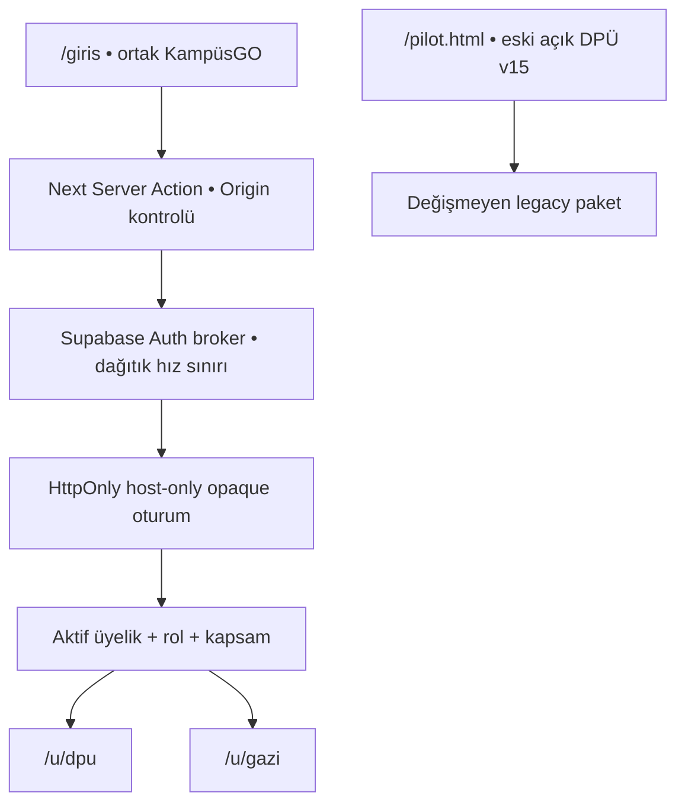

# KampüsGO hesaplı çok-kurum pilotu — uygulama ve güvenlik notu

Tarih: 7 Eylül 2026

Dal: `feature/multi-university-entry-gazi`

Başlangıç commit'i: `42e2a5b5afb6d94fdb3c65a752e5b2d89573e8cc`

Yayın sınırı: yalnız ayrı Vercel Preview; `main`, production ve `kampusgo.uzemgo.com` değiştirilmez.

## İki ayrı pilot sınırı

| Kapsam | Yol | Kimlik/yetki kaynağı | Veri kaynağı | Durum |
| --- | --- | --- | --- | --- |
| Korunan eski DPÜ v15 demosu | `/pilot.html` | Açık demo seçicisi; güvenlik yetkisi değildir | `kdpu-myys-pilot-v4` tarayıcı kaydı + mevcut statik veri | Kaynak dosyaları byte düzeyinde korunur |
| Yeni hesaplı DPÜ | `/u/dpu` | Supabase Auth + aktif üyelik + atanmış rol + kapsam | Kurum/sahiplik sınırlı Supabase kayıtları | Feature Preview |
| Yeni hesaplı Gazi | `/u/gazi` | Supabase Auth + aktif üyelik + atanmış rol + kapsam | Gazi kurumuna ve kullanıcıya bağlı sentetik kayıtlar | Feature Preview |

Yeni giriş hiçbir kullanıcıyı eski açık demoya yönlendirerek korumalı erişim iddiası kurmaz. Eski tarayıcı kayıtları yeni hesaba otomatik bağlanmaz, silinmez veya Gazi alanına taşınmaz.

## Önce / sonra mimari

### Önce

- `/` doğrudan `/pilot.html` yoluna yönleniyordu.
- Demo giriş/rol seçimi `src/app.js` içinde istemci tarafındaydı; `localStorage` yetki kanıtı değildi.
- `profiles.organization_id` ve legacy `private.has_role(text)` tek kurum varsayımına dayanıyordu.
- Yayındaki DPÜ v15, dokuz demo rolü ve bütün mevcut varlıklarıyla statik paketti.

### Sonra

- Parola yalnız Next sunucusundan Supabase Edge broker'a gider; istemci JavaScript'i parolayı karşılaştırmaz.
- Broker Supabase Auth `signInWithPassword` sonrasında taze kullanıcı kimliğini `getUser(access_token)` ile doğrular. `getSession()` kullanıcı nesnesi veya değiştirilebilir metadata yetki kanıtı değildir.
- Tarayıcıya Supabase erişim/yenileme token'ı verilmez. Rastgele 256-bit opaque değer `Secure`, `HttpOnly`, `SameSite=Lax`, host-only çerezde tutulur; veritabanında yalnız hash'i anahtardır ve oturum iptal edilebilir.
- Korumalı her bağlam/çalışma alanı/komut isteği güncel kullanıcıyı, profil aktifliğini, kurum üyeliğini, rolü ve gerektiğinde karar kapsamını yeniden denetler.
- İstemcinin rota ve rol değeri yalnız seçicidir. RLS/RPC denetimi geçmeden veri dönmez veya işlem yapılmaz.
- Kurum değişimi global oturum bağlamını değiştirmez; kurum ve rol sekme URL'sinde seçilir ve her istekte yeniden doğrulanır. Böylece iki sekme birbirinin kurumunu değiştirmez.
- Korumalı içerikte ve `Set-Cookie` yanıtlarında `private, no-store`; CSP'de istek başına nonce, `strict-dynamic`, dar `connect-src` ve ayrı statik demo politikası kullanılır.

## Veri modeli ve legacy uyumluluk

Mevcut `organizations`, `profiles`, `roles` ve birleşik anahtarlı `user_roles` yeniden kurulmadı. `profiles.organization_id` legacy birincil kurum alanı olarak kaldı; `private.has_role(text)` imzası/davranışı değiştirilmedi.

Yeni omurga:

- `organization_memberships`: kullanıcı–kurum üyeliği, aktiflik, birim, üye türü, görev süresi ve karar kapsamı.
- `pilot_workspace_settings`: kuruma özgü rota, görünüm, modül ve sürüm.
- `pilot_institutional_rules`: kaynak, sürüm, statü, yürürlük, hesaplama temeli ve karar sahibi.
- `pilot_account_catalog`, `pilot_account_cases`, `pilot_account_case_actions`: kurum sahipliğinde sentetik katalog, başvuru/öneri ve gerekçeli işlem izi.
- `pilot_account_credentials`: doğrulama, AKTS tanıma ve ders yerine saymayı ayrı statülerde tutan simülasyon kaydı.
- `pilot_finance_dry_runs`, `pilot_integration_dry_runs`, `pilot_admin_access_checks`: gerçek dış sisteme bağlanmayan rol-sınırlı işlemler.
- `pilot_command_receipts`: kurum + kullanıcı + idempotency anahtarına bağlı işlem sonucu.
- `private.pilot_login_identities`, `private.pilot_login_attempts`, `private.pilot_server_sessions`: anonim istemciye kapalı kullanıcı adı eşleme, dağıtık hız sınırı ve iptal edilebilir oturum.

Yeni public tabloların tamamında RLS + FORCE RLS vardır. `authenticated` yalnız gerekli `SELECT` grant'lerini alır; doğrudan `INSERT/UPDATE/DELETE` verilmez. Yazmalar public `SECURITY INVOKER` sarmalayıcıdan erişilen, sabit `search_path` kullanan private komut gövdesinden geçer. Kurumlar arası kayıt bağlama, `(organization_id, id)` ve `(user_id, organization_id)` bileşik yabancı anahtarlarıyla engellenir.

## Dokuz rol ve çalışan temel işlem

| Rol | Pilot hesap kalıbı | Çalışan temel işlem | Yetki sınırı |
| --- | --- | --- | --- |
| Öğrenen / Öğrenci | `{dpu,gazi}.ogrenci` | Katalogdan kendi sentetik başvurusunu oluşturma ve izleme | Yalnız kendi kaydı |
| Üniversite içi eğitici | `{dpu,gazi}.ic.egitici` | Sentetik program önerisi | Kurum içi sağlayıcı kaydı |
| Kurum dışı eğitici | `{dpu,gazi}.dis.egitici` | Sentetik program önerisi | Kurumsal e-posta zorunluluğu yok; dış sağlayıcı kaydı |
| Koordinatörlük / SEM | `{dpu,gazi}.koordinator` | Eksiksizlik incelemesiyle komisyona aktarma | Akademik karar üretmez |
| Mikro Yeterlilik Komisyonu | `{dpu,gazi}.komisyon` | Ayrı ve gerekçeli pilot karar | Atanmış kurum + `case_review` kapsamı |
| Öğrenci İşleri | `{dpu,gazi}.ogrenci.isleri` | Sentetik cüzdan/belge kaydı | Tanıma ve ders yerine sayma ayrı kalır |
| Bilgi İşlem | `{dpu,gazi}.bilgi.islem` | Bağlantısız entegrasyon dry-run | Gerçek veri/anahtar/dış istek yok |
| Finans / Döner Sermaye | `{dpu,gazi}.finans` | Tahsilatsız mali dry-run | Akademik karar ve gerçek işlem yok |
| Sistem yöneticisi | `{dpu,gazi}.sistem` | Kurum içi üyelik bağ kontrolü | Akademik/mali karar veremez; başka kuruma erişmez |

Ek senaryolar: `cift.kurum` kullanıcısı DPÜ'de Koordinatörlük, Gazi'de Komisyon rolüne sahiptir; roller birleşmez. `pilot.pasif` pasif profil, `pilot.atamasiz` ise profil/kurum ataması olmayan hesap durumunu sınar. Parolalar ve Auth e-postaları kaynak kodunda, seed'de, CI logunda veya bu belgede bulunmaz.

## Gazi tasarımı ve kaynakları

Gazi alanı DPÜ temasının logo değiştirilmiş kopyası değildir: açık editoryal ana sayfa, kanıttan karara süreç şeridi, koyu kaynak/statü rayı, GAZİSEM bağlamı, rol işlemi, yetkili kayıt listesi ve belge/rapor altbilgisi kullanır. DPÜ alanı mevcut pilotun koyu lacivert–altın operasyon görünümünü sürdürür. CSS modülleri kurum bileşenleriyle sınırlıdır; Görsel Akademi ve statik DPÜ stillerine ek seçici yazılmaz.

Doğrulanan resmî başlangıçlar:

- Gazi Türkçe logosu: <https://sosyalisler.gazi.edu.tr/view/page/288205/universitemiz-logosu>. Kaynaktaki PNG doğrudan kullanılır; SHA-256 `bc56cb3a2b3d00e79f317cf5854b533f4de2850c16638d7f9dc808d55c325947`.
- Kurumsal kimlik kılavuzu: <https://basin.gazi.edu.tr/view/page/197633> ve bağlantılı kılavuz sayfası <https://basin.gazi.edu.tr/view/page/197666?siteUri=basin>. Kılavuzdaki Pantone 534C / 7457C karşılıkları ve resmî PNG baskın renkleri temel alınarak `#113971` ve `#BBE3FA` kullanılır.
- GAZİSEM adı/bağlamı: <https://gazisem.gazi.edu.tr/view/page/192445>.

Katalogtaki üç Gazi programı da `SENTETİK` olarak etiketlidir ve üniversitenin gerçekten sunduğu eğitim iddiası taşımaz. Koordinasyon/komisyon yetkisi, AKTS, ders yerine sayma, süre, oran veya sayısal eşik gibi Gazi kuralları `institutional_confirmation_required` statüsündedir. DPÜ'deki `%10`, `%50`, dönemlik `5 AKTS`, `3–8. dönem` ve `30 gün` gibi demo değerleri Gazi kuralı olarak taşınmaz.

## Migration, seed ve geri alma

Canlı `xpjkrwzgimdxsasqszfi` projesine aşağıdaki eklemeli migration'lar sırayla uygulanmıştır:

1. `20260907010000_multi_university_accounted_pilot.sql`
2. `20260907011000_gazi_accounted_pilot_seed.sql`
3. `20260907012000_pilot_account_provisioning_api.sql`
4. `20260907013000_fix_pilot_session_lookup_ambiguity.sql`
5. `20260907014000_harden_pilot_rpc_exposure.sql`
6. `20260907015000_accounted_pilot_fk_indexes.sql`

Her dosyanın `supabase/rollback/` altında eşlenik geri alma dosyası vardır. Geçmiş migration değiştirilmedi; canlı doğrulamada bulunan oturum lookup belirsizliği ve advisor sertleştirmesi ayrı ileri migration'larla düzeltildi. Paylaşılan veritabanında tablo dönüştürme, veri silme, legacy politika genişletme veya `profiles` UPDATE grant'i yapılmadı.

Canlı seed yalnız sentetik içerik ve 21 pilot Auth hesabı oluşturdu: kurum başına dokuz rol, bir çoklu kurum, bir pasif ve bir kurumsuz hesap. Davet/e-posta/SMS gönderilmedi. Geçici provisioning işlevi hesap üretimi sonrasında kapatıldı ve doğrulanmış JWT olmadan çağrılamayan `410 Gone` sürümüyle değiştirildi.

## Test sözleşmesi

Başlangıçta `npm test` ve `npm run build` başarılıydı. Yerel Playwright paketi bulunmasına karşın tarayıcı ikilisi ortamda yoktu; CDN kurulum denemesi zaman aşımına uğradı. Bu nedenle browser testi yalnız aynı commit'e ait Vercel Preview hazır olduğunda container/Preview veya mevcut uzaktan tarayıcıyla alınmalıdır; eski bir PASS yeni sürüm kanıtı sayılmaz.

Eklenen kontroller:

- Legacy DPÜ kritik dosyaları ve marka varlıkları için byte hash sözleşmesi.
- Auth akışında `getUser`, HttpOnly/host-only cookie, no-store, CSRF Origin ve localStorage/token negatif taraması.
- RLS/FORCE RLS/grant, cross-org, wrong-role, başka sahip, doğrudan yazma, profil self-update ve legacy DPÜ erişim negatif SQL testleri.
- Eğitici → koordinatör → komisyon farklı hesap zinciri; öğrenci başvurusu, Öğrenci İşleri, Finans, Bilgi İşlem ve Sistem Yöneticisi rol işlemleri.
- Gerçek Edge akışında tek tip hatalı giriş, Gazi kayıt oluşturma, kurum/rol reddi, logout sonrası eski oturumun reddi, çoklu/pasif/kurumsuz bağlam ve veritabanı destekli hız sınırı.
- Preview browser QA: giriş 1440/1024/768/390; iki kurum × dokuz rol × dört genişlik; doğrudan URL reddi; Gazi öğrenci işlemi; cookie özellikleri; çıkış/geri; iki sekme; pasif/kurumsuz; DPÜ legacy localStorage değişmezliği; metadata, kırık görsel, konsol ve yatay taşma.
- `api/build-info` ile test URL'sinin Vercel proje kimliği, Preview ortamı ve tam commit SHA eşleşmesi.

Yeni `.github/workflows/accounted-pilot-preview-qa.yml` yalnız elle ve kesin `.vercel.app` URL + tam commit ile çalışır. Hesap matrisi tek şifreli GitHub Actions secret'ından geçici `0600` dosyasına alınır; kanıt paketine veya loga eklenmez. Eski `nine-role-preview-qa.yml` main davranışını korur ve elle kesin hedef verilmesini destekler.

## Bilinen sınırlar ve açık kararlar

- Eski `/pilot.html` bilinçli olarak herkese açık kalır; yalnız hesaplı yollar yeni yetki modelindedir.
- Hesaplı DPÜ alanı mevcut tema ve temel dokuz rol işlemlerini sunar; legacy `localStorage` geçmişini sahiplenmez. Eski v15'in geniş demo veri seti ayrıca `/pilot.html` altında korunur.
- Açık kayıt, davet, parola sıfırlama iletisi, SSO, SMS/e-posta, biyometri, ödeme, imza veya gerçek OBS/ÖYS/YÖKSİS/e-Devlet/GİB/MYS/MAYS/EBYS entegrasyonu yoktur.
- Supabase Auth sızmış parola koruması proje düzeyinde kapalı olduğuna dair advisor uyarısı vermektedir; mevcut connector bu ayarı değiştirmedi. Production değerlendirmesinde açılmalıdır.
- Legacy `profiles` update politikasında daha önceden bulunan `private.has_role → profiles` özyineleme davranışı doğrudan self-update denemesinde `42P17` üretir. Değişiklik yine reddedilir; eski tüketicileri etkileyebilecek bu fonksiyon bu feature'da değiştirilmedi.
- Gazi'nin mikro-yeterlilik karar organı, onaylı süreç sırası, görev süreleri, AKTS/tanıma ölçütleri ve belge terminolojisi yetkili kurum tarafından doğrulanmadan `verified` durumuna geçirilemez.

## Geri alınabilir yayın adımı

Production bu görev kapsamında **NO-GO**'dur. Daha sonra kurumsal onay verilirse:

1. Draft PR'ı gözden geçirip aynı commit'in Preview kanıtlarını ve Supabase yedeğini doğrula.
2. Pilot hesap parolalarını döndür; kullanılmayan hesapları ve oturumları iptal et.
3. Gazi kurallarını yetkili karar/kaynakla yeni ileri migration'da sürümle; mevcut geçmiş migration'ı değiştirme.
4. PR'ı kontrollü merge et ve production deployment'ı ayrı değişiklik penceresinde oluştur.
5. Özel alan adına geçmeden önce deployment ID/commit/health/browser matrisini yeniden doğrula.
6. Sorunda aliası önceki READY production deployment'a döndür; yeni oturumları iptal et. Veri rollback'i yalnız bileşik bağımlılık sırasını izleyen sürümlü rollback dosyaları ve alınmış yedek üzerinden, ayrıca onayla uygula.

Bu feature çalışması özel alan adı, DNS, production hedefi, mevcut DPÜ deployment'ı veya eski alias yetkilendirme iş akışını değiştirmez.
